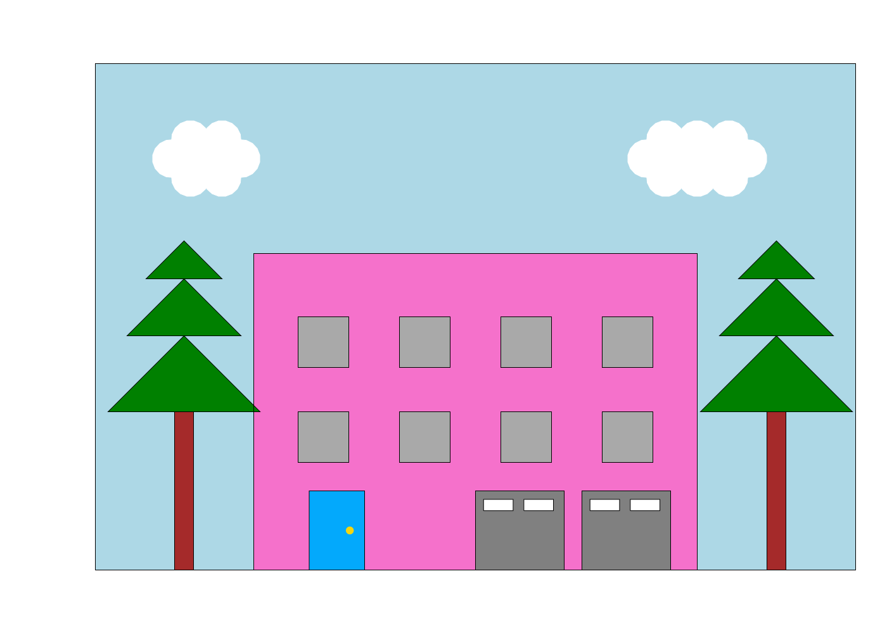

# BIODS253 Project 1
This repository contains the code to draw the following house.



## Usage 
Start by cloning the repository to your local directory:
```
git clone https://github.com/minwoosun/BIODS253-project1.git
```

Install relevant dependencies by running: 
```
conda env create -f environment.yml
```

## Development 
Code for drawing all components of the house is contained in **house.py**.

To draw the house, please run:
```bash
$ python house.py
```

By default, the drawing of the house should look exactly like the screenshot
above.

To test the implementation, please run:
```bash 
$ python shape_test.py
```
`shape_test.py` contains 6 unit tests that test various elements of the house,
in addition to the house as a whole.

## Generating Pre- and Post-Earthquake Scenes
A "generate_springfield.sh" script is included to generate either the pre- or
post-earthquake scene. To generate the pre-earthquake scene, please run the
following from the root directory of this package:

```bash
$ bash generate_springfield.sh no_earthquake
```

To generate the post-earthquake scene, please run the following from the root
directory of this package:

```bash
$ bash generate_springfield.sh earthquake
```

## Your house must have:
- [x] At least 4 windows
- [x] At least two garage doors
- [x] At least one door
- [x] At least two trees
- [x] One or more clouds

## Deliverables:
- [x] A public or private github repository to which you’ve added me (vijayp) as a collaborator
- [x] A short video (one minute or less) that you’ve made with your team (you can record this on zoom if you’d like) where you describe your design and quickly walk us through your solution.  Talk about what worked well, and what was difficult.
- [x] Write a readme file that makes it easy for someone not familiar with this program or language to download, install, run your tests if any, and then run your code.
